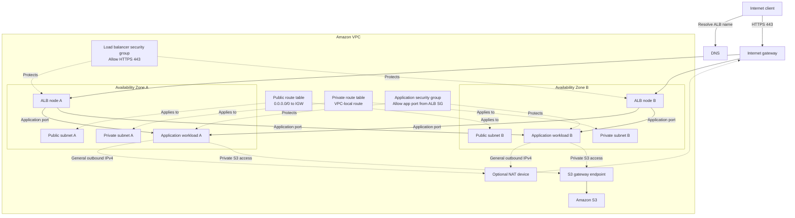

# Day 13 — VPC Traffic Path and Diagnosis

## Architecture diagram

## Request and response path

1. The client asks DNS to resolve the load balancer's public hostname.
2. The client sends an HTTPS request to the internet-facing load balancer.
3. The internet gateway provides the VPC path for internet traffic, and the public subnet route table contains `0.0.0.0/0` pointing to the internet gateway.
4. The load balancer security group checks whether inbound HTTPS traffic is allowed.
5. The load balancer forwards the request to an application workload in a private subnet.
6. The application security group allows the application port only when the traffic originates from the load balancer security group.
7. Security groups are stateful, so response traffic for an accepted connection is automatically allowed.
8. The application response returns through the load balancer to the client.

Route tables choose the next network hop according to the destination address. Security groups filter traffic at associated resources and network interfaces.

## Troubleshooting table

| Failure | Symptom | Evidence to inspect | Root cause | Specific repair |
|---|---|---|---|---|
| Public default route missing | Clients cannot reach the load balancer | Public route table and subnet associations | The public subnets have no `0.0.0.0/0` route to the internet gateway | Add the internet-gateway default route to the public route table |
| HTTPS missing from ALB security group | Client connections time out | Load balancer security group inbound rules | TCP port 443 is not allowed from the required client source | Add an inbound HTTPS rule using the narrowest appropriate source |
| Application port blocked | Targets become unhealthy or the ALB returns an error | Target health, application port and application security group | The application security group does not allow traffic from the ALB security group | Allow the application port with the ALB security group as the source |
| Private workload uses IGW directly | General outbound IPv4 connections fail | Private route table and whether the workload has a public IPv4 address | A private workload without a public IPv4 address cannot use an internet gateway directly | Route required outbound IPv4 traffic through a NAT device or use an appropriate VPC endpoint |
| Network ACL blocks return traffic | Connections time out even though security groups allow them | Network ACL rules and VPC Flow Logs | The stateless network ACL does not allow the required return traffic | Add narrowly scoped inbound and outbound rules for the required traffic and return ports |

## NAT compared with an S3 gateway endpoint

A private workload commonly uses a NAT device when it needs general outbound IPv4 access to public internet destinations. The private route table requires a default route pointing to that NAT device.

An S3 gateway endpoint provides a private route from the VPC to Amazon S3. S3 traffic using the endpoint does not need to pass through a NAT device or internet gateway.